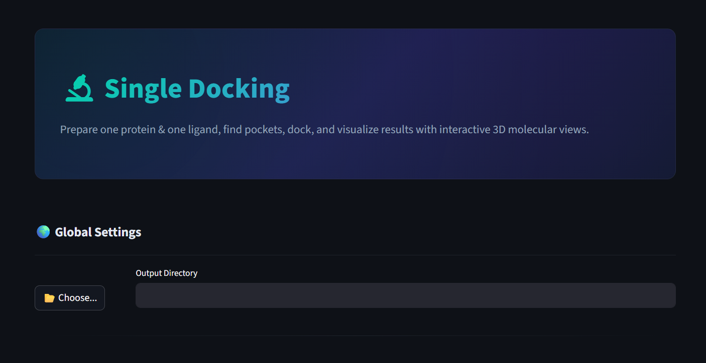
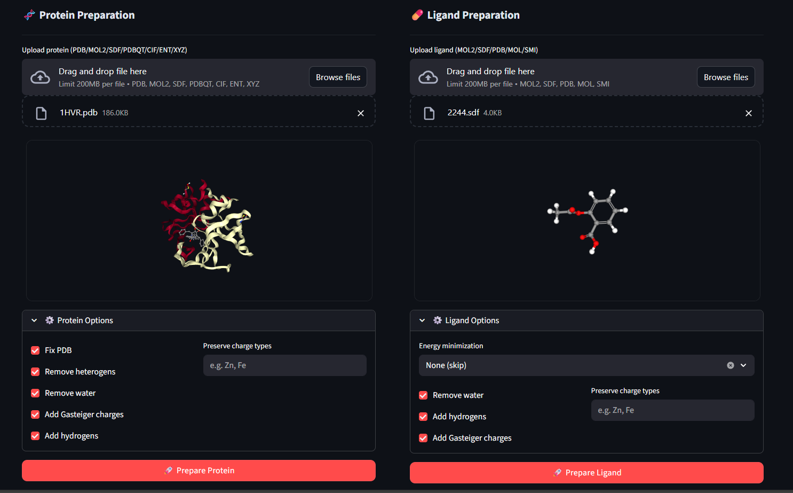
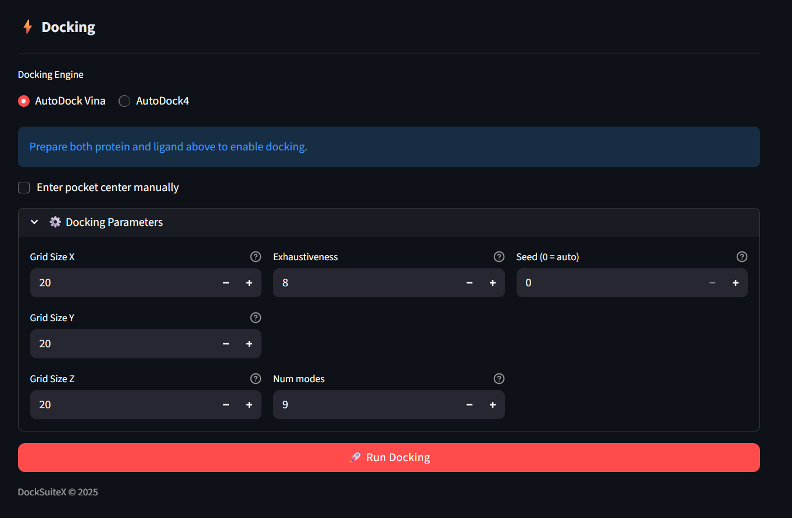
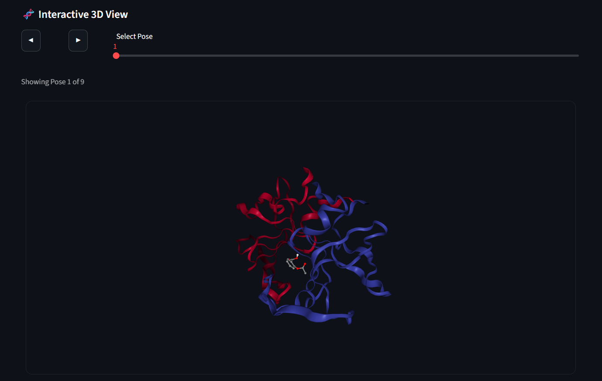

# GUI Application

DockSuiteX comes with a full-featured **GUI application** built with Streamlit, providing a complete graphical interface for all docking workflows — no command-line or coding experience needed.

The easiest way to use DockSuiteX is via the GUI command.

## Installation

1. Ensure Python 3.9+ is installed.
2. Install the package:
   ```bash
   pip install docksuitex
   ```
3. Run the GUI:
   ```bash
   docksuitex
   ```
4. The GUI will open in your browser automatically.

---

## Uninstallation

To completely uninstall DockSuiteX, you should first remove the downloaded binary executables and then uninstall the Python package.

1. **Remove Binaries**:
   ```bash
   docksuitex --clean
   ```
2. **Uninstall Package**:
   ```bash
   pip uninstall docksuitex
   ```

---


## Screenshots













